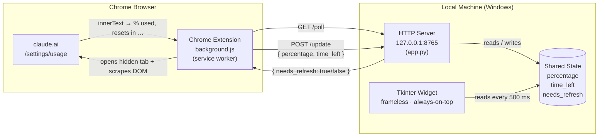
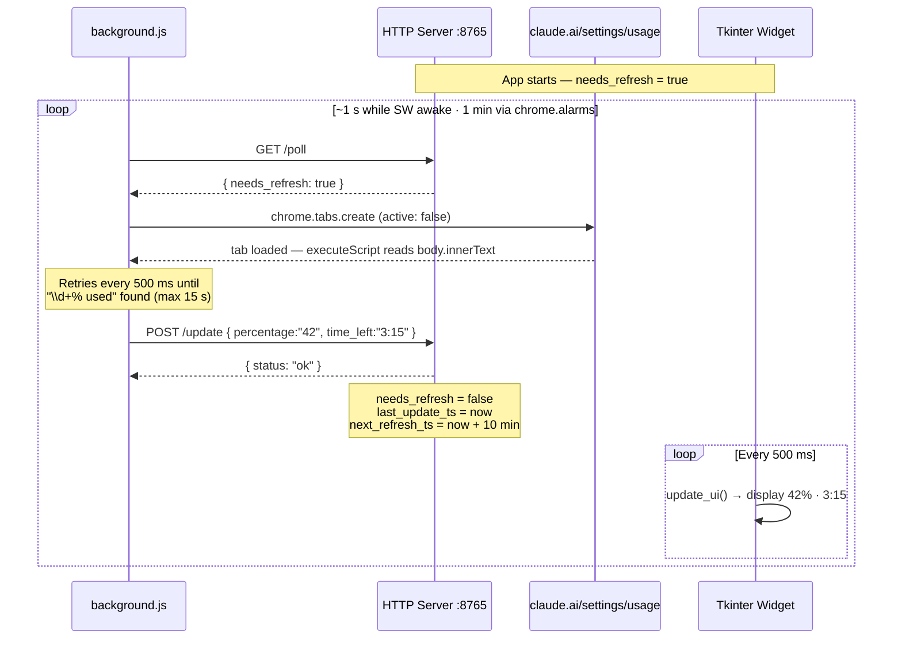
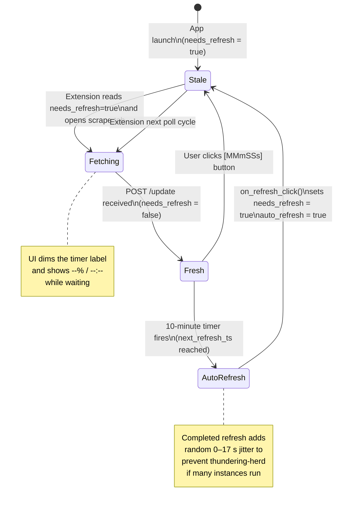
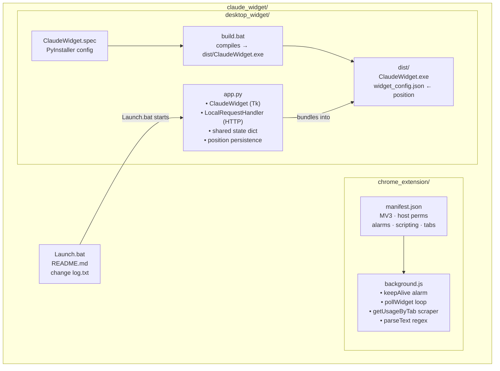

# Claude Widget — Architecture Diagrams

---

## 1. System Architecture

High-level view of the two independent components and how they communicate over localhost.

---

## 2. Poll / Scrape / Update Sequence

One full refresh cycle, from the service worker waking up to the widget displaying new data.

---

## 3. Widget Refresh State Machine

How `needs_refresh` moves through states driven by the timer, the user, and incoming updates.

---

## 4. File & Responsibility Map

Source files, what each owns, and the runtime boundary between the two processes.

